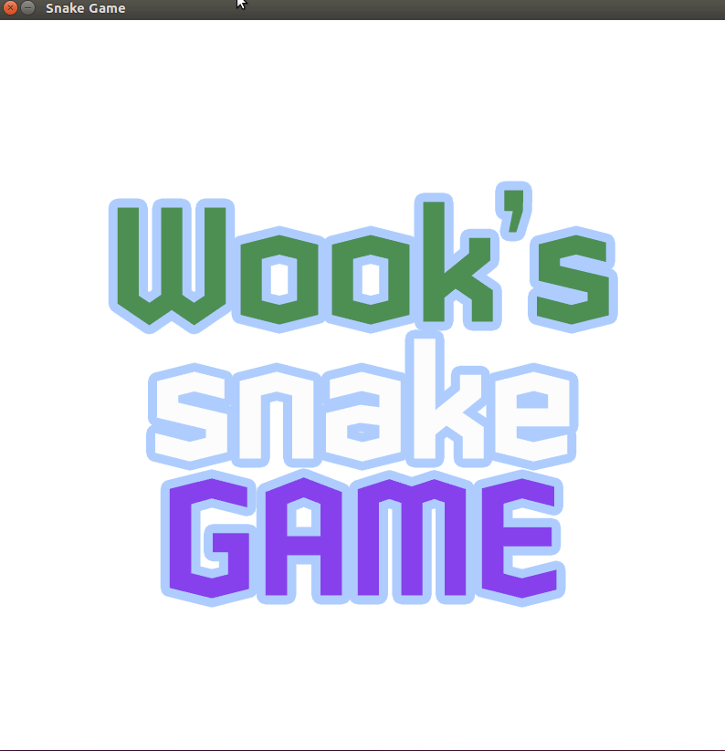

# CPPND: Capstone Snake Game: Wook's Snake

This is a repo for the Capstone project in the [Udacity C++ Nanodegree Program](https://www.udacity.com/course/c-plus-plus-nanodegree--nd213). The code for this repo was inspired [this](https://codereview.stackexchange.com/questions/212296/snake-game-in-c-with-sdl) excellent StackOverflow post and set of responses.

# Rule of this snake_game

1. There are enemy snakes(color pink) that try to eat the food as fast as possible. You(color sky blue) have to get the food faster than others
2. There are barrier(color grey) that kill snakes who contact their head to the barrier wall. Therefore You have to try to avoid the barrier

- This barrier updates according to the each snakes own score

3. There are several kinds of food: normal(color yellow), double up(color blue), life up(color green), kill others(color magenta)

- normal(color yellow): if 'you and enemies' eat that food, their score and body grows, also moving speed gets faster
- double up(color blue): if 'you and enemies' eat that food, their score and body grows doubles, also moving speed gets faster doubles
- life up(color green): if 'you' eat that food, your life(ea) grows up
- kill others(color magenta): if 'you' eat that food then, it works that if there are enemies that have more size of body than you, then they are killed

4. You and enemy snakes fight each others, if you touch the tail of enemy snakes, then you kill that enemy, otherwise you can be kill by enemies

5. Tip: if you dead, then your body is reset and head color is changed to dark red for a while, Enemis when dead are similar to you

## Dependencies for Running Locally

- cmake >= 3.7
  - All OSes: [click here for installation instructions](https://cmake.org/install/)
- make >= 4.1 (Linux, Mac), 3.81 (Windows)
  - Linux: make is installed by default on most Linux distros
  - Mac: [install Xcode command line tools to get make](https://developer.apple.com/xcode/features/)
  - Windows: [Click here for installation instructions](http://gnuwin32.sourceforge.net/packages/make.htm)
- SDL2 >= 2.0
  - All installation instructions can be found [here](https://wiki.libsdl.org/Installation)
  - Note that for Linux, an `apt` or `apt-get` installation is preferred to building from source.
- gcc/g++ >= 5.4
  - Linux: gcc / g++ is installed by default on most Linux distros
  - Mac: same deal as make - [install Xcode command line tools](https://developer.apple.com/xcode/features/)
  - Windows: recommend using [MinGW](http://www.mingw.org/)

## Basic Build Instructions

1. Clone this repo.
2. Make a build directory in the top level directory: `mkdir build && cd build`
3. Compile: `cmake .. && make`
4. Run it: `./SnakeGame`.

## PROJECT SPECIFICATION RUBRICS

- C++ Capstone Project (200823~) [RUBRICS](https://review.udacity.com/#!/rubrics/2533/view)

1. README (All Rubric Points REQUIRED): CRITERIA MEETS SPECIFICATIONS --> DONE (9/12)

- 1-1) A README with instructions is included with the project:
  The README is included with the project and has instructions for building/running the project.
  If any additional libraries are needed to run the project, these are indicated with cross-platform installation instructions.
  You can submit your writeup as markdown or pdf.
- 1-2) The README indicates which project is chosen:
  The README describes the project you have built.
  The README also indicates the file and class structure, along with the expected behavior or output of the program.
- 1-3) The README includes information about each rubric point addressed:
  The README indicates which rubric points are addressed. The README also indicates where in the code (i.e. files and line numbers) that the rubric points are addressed.

2. Compiling and Testing (All Rubric Points REQUIRED): CRITERIA MEETS SPECIFICATIONS --> DONE (9/12)

- 2-1) The submission must compile and run:
  The project code must compile and run without errors.
  We strongly recommend using cmake and make, as provided in the starter repos. If you choose another build system, the code must compile on any reviewer platform.

3. Loops, Functions, I/O: CRITERIA MEETS SPECIFICATIONS

- 3-1) The project demonstrates an understanding of C++ functions and control structures:
  A variety of control structures are used in the project.
  The project code is clearly organized into functions.
  --> DONE: you can check the various member function in game.cpp (9/12)

- 3-2) The project reads data from a file and process the data, or the program writes data to a file:
  The project reads data from an external file or writes data to a file as part of the necessary operation of the program.

- 3-3) The project accepts user input and processes the input"
  The project accepts input from a user as part of the necessary operation of the program.

4. Object Oriented Programming: CRITERIA MEETS SPECIFICATIONS

- 4-1) The project uses Object Oriented Programming techniques:
  The project code is organized into classes with class attributes to hold the data, and class methods to perform tasks.
- 4-2) Classes use appropriate access specifiers for class members:
  All class data members are explicitly specified as public, protected, or private.
- 4-3) Class constructors utilize member initialization lists:
  All class members that are set to argument values are initialized through member initialization lists.
- 4-4) Classes abstract implementation details from their interfaces:
  All class member functions document their effects, either through function names, comments, or formal documentation. Member functions do not change program state in undocumented ways.
- 4-5) Classes encapsulate behavior:
  Appropriate data and functions are grouped into classes. Member data that is subject to an invariant is hidden from the user. State is accessed via member functions.
- 4-6) Classes follow an appropriate inheritance hierarchy:
  Inheritance hierarchies are logical. Composition is used instead of inheritance when appropriate. Abstract classes are composed of pure virtual functions. Override functions are specified.
- 4-7) Overloaded functions allow the same function to operate on different parameters:
  One function is overloaded with different signatures for the same function name.
- 4-8) Derived class functions override virtual base class functions:
  One member function in an inherited class overrides a virtual base class member function.
- 4-9) Templates generalize functions in the project:
  One function is declared with a template that allows it to accept a generic parameter.

5. Memory Management: CRITERIA MEETS SPECIFICATIONS

- 5-1) The project makes use of references in function declarations:
  At least two variables are defined as references, or two functions use pass-by-reference in the project code.
- 5-2) The project uses destructors appropriately:
  At least one class that uses unmanaged dynamically allocated memory, along with any class that otherwise needs to modify state upon the termination of an object, uses a destructor.
- 5-3) The project uses scope / Resource Acquisition Is Initialization (RAII) where appropriate:
  The project follows the Resource Acquisition Is Initialization pattern where appropriate, by allocating objects at compile-time, initializing objects when they are declared, and utilizing scope to ensure their automatic destruction.
- 5-4) The project follows the Rule of 5:
  For all classes, if any one of the copy constructor, copy assignment operator, move constructor, move assignment operator, and destructor are defined, then all of these functions are defined.
- 5-5) The project uses move semantics to move data, instead of copying it, where possible:
  For classes with move constructors, the project returns objects of that class by value, and relies on the move constructor, instead of copying the object.
- 5-6) The project uses smart pointers instead of raw pointers:
  The project uses at least one smart pointer: unique_ptr, shared_ptr, or weak_ptr. The project does not use raw pointers.

6. Concurrency: CRITERIA MEETS SPECIFICATIONS

- 6-1) The project uses multithreading:
  The project uses multiple threads in the execution.
- 6-2) A promise and future is used in the project:
  A promise and future is used to pass data from a worker thread to a parent thread in the project code.
- 6-3) A mutex or lock is used in the project:
  A mutex or lock (e.g. std::lock_guard or `std::unique_lock) is used to protect data that is shared across multiple threads in the project code.
- 6-4) A condition variable is used in the project:
  A std::condition_variable is used in the project code to synchronize thread execution.
